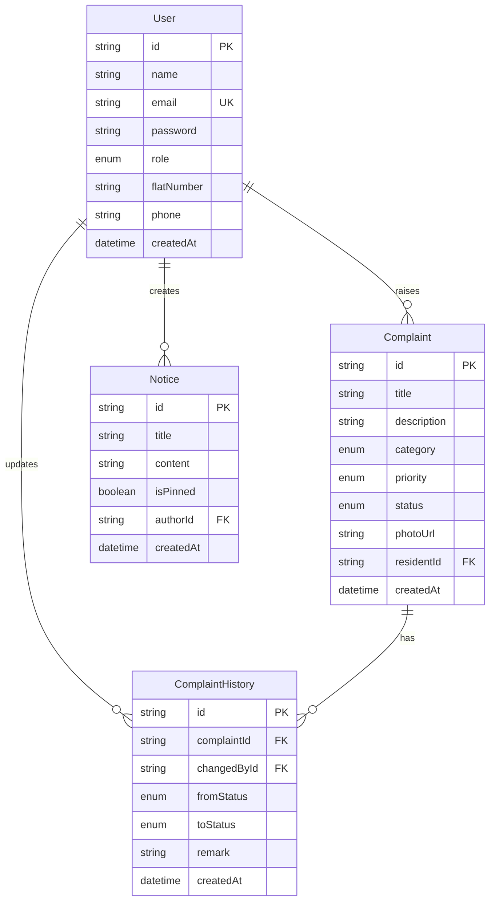

# Grand Arch Residences — Society Maintenance Management System

A production-grade, containerized, full-stack operational workspace designed for modern residential societies. It enables residents to report maintenance issues, seek smart AI-assisted suggestions, identify duplicate claims pre-submission, and allows administrators to organize, assign, track, and audit maintenance activities through a robust, responsive dashboard.

---

## 1. Project Overview & Problem Statement

### Problem Statement
Managing maintenance operations in a residential society using manual lists, group chats, or legacy spreadsheets leads to several systemic inefficiencies:
1. **Lack of Structure:** Incoming issues are poorly categorized and prioritized.
2. **Submissions Bloat:** Residents file duplicate requests for shared problems (e.g. lift outages, corridor lighting).
3. **No Audit Trail:** Accountability is lost when work changes hands.
4. **Poor Communication:** Residents remain in the dark about resolution timelines, while admins lack analytical insights.

### Solution
Grand Arch Residences solves these challenges by providing:
- A structured, role-based reporting workflow with progressive validation.
- An **AI Assistant** to write clear titles, auto-categorize issues, and assess urgency.
- A **Smart Duplicate Detector** to flags similar issues pre-submission.
- A **70/30 Audit Trail Log** showing historical state transitions and remarks.
- A **Bulletin Board** for pinned community alerts and announcements.

---

## 2. Technology Stack

| Layer | Technology | Purpose |
|---|---|---|
| **Frontend** | React 19, React Router 7, Vite 6 | High-density UI component architecture and routing |
| **Backend** | Node.js 20, Express 4 | Stateless REST API service layer |
| **Database** | PostgreSQL 16 (Neon in production) | Persistent relational store |
| **ORM** | Prisma 6 | Typesafe query compilation and schema management |
| **Authentication**| JWT + bcrypt | Secure stateless session guarding |
| **AI Integration**| Groq Chat Completions (3-Model Fallback) | Context-aware analysis and similarity checks |
| **File Storage** | Cloudinary | Persistent image storage for proof uploads |
| **Email Service** | Resend | Automatic community notifications |
| **Orchestration** | Docker + Docker Compose | Containerized database and service networking |

---

## 3. Key Features

### Core Operations
- **Role-Based Auth (JWT):** Differentiates between Resident and Administrator views.
- **Reported Issues Board:** High-density, scannable issue queue with custom filters (Status, Category, Date).
- **Interactive Bulletin Board:** Announcement board supporting pin/unpin toggles and inline rich-text editing.
- **Audit Logs:** Log transitions (`OPEN` → `IN_PROGRESS` → `RESOLVED`) with accountability parameters.

### AI Assistant (Phase 15 & 17)
- **Automatic Analysis:** Triggers on user description (min 30 chars).
- **Confidence Visualization:** Shimmering block indicators (`█████████░`) ranking confidence (High/Medium/Low).
- **Explainability:** Renders detailed "Why this suggestion?" justifications.
- **Pre-submission Review Card:** Displays checklist checkmarks verifying details before submission.

### Smart Duplicate Detection (Phase 16)
- **Pre-submission Scopes:** Compares title + description against the last 30 unresolved issues from the last 60 days.
- **Non-Blocking Interface:** Warns user with similarity metrics, letting them view the existing thread or click "Continue Anyway".

---

## 4. Repository Folder Structure

```
society-maintenance-management/
├── client/                     # Frontend SPA workspace (React + Vite)
│   ├── src/
│   │   ├── api/                # API client functions using native fetch
│   │   ├── components/         # AI Panel, Duplicate Detector, Navbar, Badges
│   │   ├── context/            # AuthContext session provider
│   │   ├── pages/              # Dashboard, Issues Board, Bulletin Board, Auth
│   │   ├── styles/             # CSS variable design system & global overrides
│   │   └── utils/              # Client constants and helpers
│   ├── Dockerfile              # Multi-stage production Nginx runner
│   ├── nginx.conf              # SPA route rewriting config
│   └── vercel.json             # Vercel routing configuration
├── server/                     # Backend API workspace (Express + Prisma)
│   ├── prisma/                 # Database schema and seed scripts
│   ├── src/
│   │   ├── config/             # DB client and Cloudinary connection helpers
│   │   ├── controllers/        # REST controllers (Auth, AI, Issues, Notices)
│   │   ├── middleware/         # Auth filters, validation schema, error handler
│   │   ├── routes/             # REST route registers
│   │   ├── services/           # Service layer (Groq fallbacks, Resend)
│   │   ├── validations/        # Express validator schemas
│   │   └── utils/              # API response structures and constants
│   ├── Dockerfile              # Two-stage production API builder
│   └── server.js               # Database connection bootstrap
├── docs/                       # High-level system documentation
├── docker-compose.yml          # Container stack orchestrator
├── .env.example                # Documented configuration template
└── SYSTEM_DESIGN.md            # System design and architecture document
```

---

## 5. Database Schema Overview



---

## 6. API Endpoint Overview

### Authentication
- `POST /api/auth/register` — Creates user account (Resident / Admin)
- `POST /api/auth/login` — Returns JWT and user profile
- `GET /api/auth/me` — Fetches current user profile (JWT protected)

### Reported Issues
- `GET /api/complaints` — Lists filtered issues
- `POST /api/complaints` — Submits a new issue (Multipart form with photo upload)
- `GET /api/complaints/:id` — Fetches detail view, audit timeline history
- `PATCH /api/complaints/:id/status` — Updates status (Admin only)

### Bulletin Board
- `GET /api/notices` — Lists announcements (Pinned first)
- `POST /api/notices` — Creates notice (Admin only)
- `PATCH /api/notices/:id` — Modifies notice content (Admin only)
- `DELETE /api/notices/:id` — Deletes notice (Admin only)
- `PATCH /api/notices/:id/pin` — Toggles pinned status (Admin only)

### AI Service
- `POST /api/ai/analyze-complaint` — Analyzes issue text using Groq
- `POST /api/ai/detect-duplicates` — Checks description against recent open issues

---

## 7. Local Docker Setup & Environment Configuration

### Prerequisite Environment setup
1. Copy the environment template:
   ```bash
   cp .env.example .env
   ```
2. Open `.env` and fill out keys for **Cloudinary**, **Resend**, and **Groq AI**.

### Orchestrate Complete Stack
Ensure Docker is active, then launch the complete stack from the root directory:
```bash
docker compose up --build
```
This builds:
- A PostgreSQL 16 container mapping port `5432`.
- The Node Express API running at `http://localhost:5000` (auto-executes db push + seeds).
- The React App running at `http://localhost:3000`.

---

## 8. Development Setup (Without Docker Compose)

### 1. Start Postgres Database
Launch the database container:
```bash
docker compose up postgres -d
```

### 2. Configure & Seed Server
```bash
cd server
npm install
npx prisma generate
npx prisma db push
npm run db:seed
npm run dev
```

### 3. Launch Frontend Client
```bash
cd client
npm install
npm run dev
```
Open `http://localhost:5173`.

---

## 9. Demo Credentials

| Profile | Email | Password | Flat/Unit |
|---|---|---|---|
| **Admin (Operations)** | `admin@society.com` | `admin@123` | OFFICE-01 |
| **Admin (Committee President)** | `admin2@society.com` | `admin@123` | OFFICE-02 |
| **Resident (Primary)** | `resident@society.com` | `resident@123` | A-101 |
| **Resident (Additional)** | `aravind@society.com` | `resident@123` | B-304 |

---

## 10. Future Architectural Scaling

1. **Redis Caching:** Introduce caching for Bulletin Board notices.
2. **WebSocket Integrations:** Shift notice and critical status updates to real-time socket connections.
3. **Optimized DB Indexes:** Add composite indexes on `Complaint(status, createdAt)` for high-scale queues.
4. **Vektor Database Embeddings:** Transition AI Duplicate check from chat prompts to local pgvector embedding searches.

---

## 11. License & Acknowledgements

- Licensed under [MIT](LICENSE).
- Powered by Groq AI and Prisma ORM.
